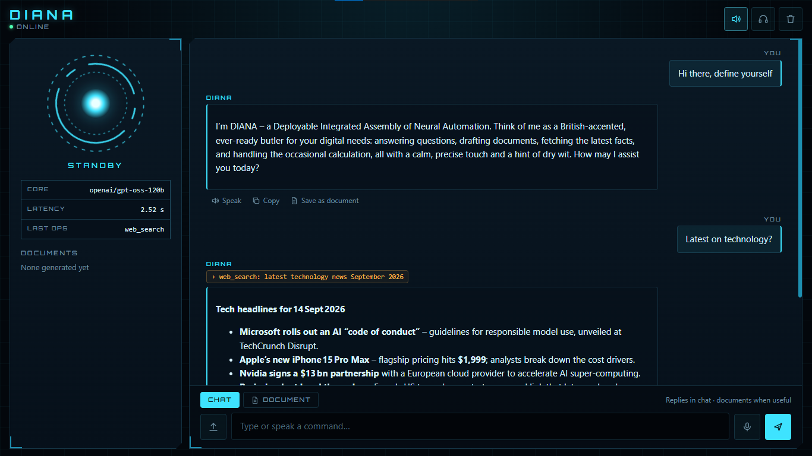
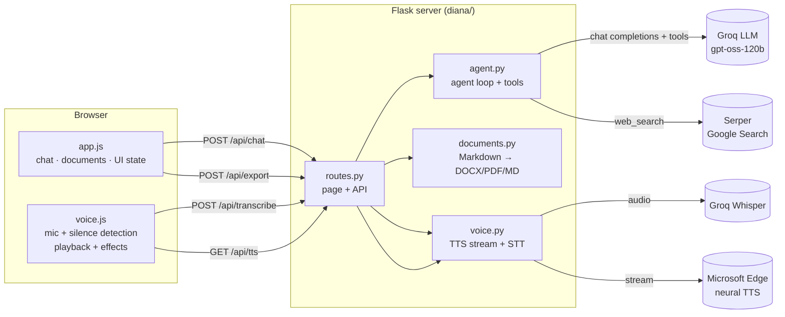

# DIANA



**Deployable Integrated Assembly of Neural Automation** is an AI assistant you can talk to or type to. It runs in your browser from a small Flask server on your own machine.

DIANA does more than chat. It decides for itself when to search the web, run a calculation or write a document. It speaks its answers in a calm British voice modelled on JARVIS. Chat, documents and voice all share one screen with a sci-fi control-panel look that is cheap to render.


---

## Contents

1. [Features at a glance](#features-at-a-glance)
2. [Quick start](#quick-start)
3. [Using DIANA](#using-diana)
4. [How it works](#how-it-works)
5. [Configuration](#configuration)
6. [HTTP API](#http-api)
7. [Project structure](#project-structure)
8. [Running tests](#running-tests)
9. [Performance and efficiency](#performance-and-efficiency)
10. [Security notes](#security-notes)
11. [Browser support](#browser-support)
12. [Known limitations](#known-limitations)
13. [Troubleshooting](#troubleshooting)
14. [Customisation](#customisation)

---

## Features at a glance

| Area | What DIANA does |
|---|---|
| **Agentic assistant** | Picks and chains its own tools (web search, calculator, document writer), up to 4 rounds per request |
| **Web search** | Live results from Google through Serper: answer box, knowledge graph, and the top 5 results with links and dates |
| **Calculator** | Exact arithmetic with a safe evaluator (no code execution) |
| **Document generation** | Letters, applications, reports, CVs, notes and more, written in Markdown |
| **Preview and edit** | A page-style preview with an editor for the title and text |
| **Export** | Download as **DOCX**, **PDF** or **Markdown**; files are built on request and never stored on disk |
| **Text input** | A message box that grows as you type; Enter sends, Shift+Enter adds a new line |
| **Voice input** | Tap the mic and speak; it stops by itself when you go quiet, and Whisper transcribes it |
| **Audio file input** | Upload an audio file (up to 25 MB) to transcribe it and send it as a message |
| **Voice output** | A British neural voice, pitched slightly lower with light effects for a synthetic sound; audio starts playing before the whole reply is synthesised |
| **Hands-free mode** | DIANA listens again after every spoken reply, for back-and-forth conversation |
| **Multilingual** | Replies in the language you use; Urdu is detected and spoken with an Urdu voice |
| **Conversation memory** | Remembers the last 12 messages, including document text, so "make it more formal" works |
| **Sci-fi interface** | An animated core with rings, status labels, a readout panel and a tool-activity log |
| **Responsive** | Laptop, tablet and phone layouts (tested at 400 px wide) |
| **Low resource use** | No animation loop, static background, animation only while DIANA is busy, honours reduced-motion settings |

---

## Quick start

### Requirements

- Python 3.10 or newer (developed on 3.13)
- A [Groq](https://console.groq.com) API key for the language model and speech-to-text
- A [Serper](https://serper.dev) API key for web search (optional; everything else works without it)
- An internet connection

### Install

```bash
git clone https://github.com/<your-username>/DIANA.git
cd DIANA
python -m venv .venv
```

Activate the environment (`.venv\Scripts\activate` on Windows, `source .venv/bin/activate` on macOS/Linux), then:

```bash
pip install -r requirements.txt
```

### Configure

Copy the example settings file, then add your keys to `.env`:

```bash
copy .env.example .env      # Windows
cp .env.example .env        # macOS / Linux
```

```env
GROQ_API_KEY=your_groq_key
SERPER_API_KEY=your_serper_key
```

Every key and setting is read from `.env` by `diana/config.py`; none are stored in code. `.env` is git-ignored, so your keys never reach GitHub. See [Configuration](#configuration) for every option.

### Run

```bash
python run.py
```

Open **http://127.0.0.1:5000**. While developing, set `FLASK_DEBUG=1` in `.env` to reload automatically when files change.

---

## Using DIANA

### The screen

```
┌──────────────────────────────────────────────────────────────────┐
│ DIANA ● Online                          [🔊 Voice] [🎧] [🗑 New] │
├───────────────┬──────────────────────────────────────────────────┤
│   ◎ core      │  You ─────────────────────── Write a leave app…  │
│   STANDBY     │  DIANA  › create_document: Leave Application     │
│               │  ┌ Your document is ready ────────────────────┐  │
│ Core   model  │  │ 📄 Leave Application · 102 words           │  │
│ Latency 0.6 s │  │ [Preview] [DOCX] [PDF] [MD]                │  │
│ Last ops …    │  └────────────────────────────────────────────┘  │
│               │  Speak · Copy · Save as document                 │
│ DOCUMENTS     │                                                  │
│ 📄 Leave App… │  [CHAT] [DOCUMENT]                               │
│               │  [⤒] [ Type or speak a command…     ] [🎤] [➤]   │
└───────────────┴──────────────────────────────────────────────────┘
```

- **Top bar:**
  - The DIANA name with a status line (Online, Listening, Processing, Speaking…).
  - **Voice** turns spoken replies on or off.
  - **Hands-free** (headset icon) makes DIANA listen again after each spoken reply.
  - **New session** clears the chat, memory and documents.
- **Side panel** (wide screens only):
  - The **core**, a set of rings around a glowing centre. It animates only while DIANA is busy and pulses with the voice level.
  - The current state in words.
  - A readout showing the model in use, the last response time, and which tools the last request used.
  - A **Documents** list with every document from this session; click one to preview it.
- **Chat:** your messages and DIANA's replies. Above each reply, small amber tags show the tools used (for example `› web_search: SpaceX news`). Below each reply are three actions: **Speak** (play it again), **Copy**, and **Save as document**.
- **Message box:**
  - **Chat / Document** toggle.
  - Audio upload button.
  - Text box.
  - Microphone button.
  - Send button.

### States

| Label | Meaning | Core |
|---|---|---|
| STANDBY | Idle, ready | Still |
| LISTENING | Recording from the microphone | Amber, pulses with your voice |
| DECODING | Transcribing speech | Spinning |
| PROCESSING | Working on your request | Spinning fast |
| VOCALIZING | Preparing the voice | Spinning |
| SPEAKING | Playing the spoken reply | Spinning, pulses with the voice |
| FAULT | Connection or service error | Still, red status dot |

### Chatting

Type a request and press **Enter**, or click a suggestion on the welcome screen. DIANA decides on its own how to handle each request:

- **Everyday questions:** answered directly and briefly (usually under about 110 words), since the answer may be read aloud.
- **Time-sensitive questions** (news, weather, prices, scores, recent events): DIANA searches the web, sometimes more than once, and names its sources.
- **Arithmetic:** handled by the calculator tool, so results are exact.
- **Something to keep, send or print:** DIANA writes a document.

### Documents

There are three ways to get a document:

1. **Ask naturally.** For example, "Draft a cover letter for a junior Python role that I can download." DIANA decides a document is the right output.
2. **Use Document mode.** Switch the toggle to **Document** (it turns amber) and every request produces a document. The mode stays on until you switch back to **Chat**.
3. **Save a reply.** Click **Save as document** under any reply. If the reply starts with a heading, that becomes the title; otherwise your question does.

Each document appears as a card showing its title and word count, with these options:

- **Preview:** opens the document as a page.
  - Edit the **title** in the header.
  - **Edit** switches to a text editor for the Markdown; **Done** returns to the preview.
  - **DOCX / PDF / MD** download the current version, including your edits.
  - Close with ✕, **Esc**, or a click outside the window.
- **DOCX / PDF / MD:** download straight away.

You can ask for changes in chat, such as "Make it more formal" or "Add a paragraph about my availability". DIANA remembers the document and produces a revised version.

**Formatting that carries into previews and exports:**
- Headings, bold, italics and inline code
- Bullet and numbered lists
- Tables
- Code blocks
- Horizontal rules
- Line breaks (addresses and sign-offs keep their layout)

### Voice input

- Tap the **microphone** and speak. Recording stops by itself about **1.3 s after you stop talking**.
  - If no speech is heard within 8 s, it cancels.
  - Recordings are capped at 60 s.
- Tap the mic again (now a stop icon) to finish early. The recording is sent even if it was quiet.
- **Esc** cancels listening without sending.
- Speech is transcribed by Whisper (`whisper-large-v3-turbo`), which handles many languages including Urdu. The transcript is then sent like a typed message.
- **Upload an audio file** with the upload button: mp3, wav, m4a, webm, ogg and others, up to 25 MB. It's transcribed and sent the same way. The button is hidden on very narrow screens.

### Voice output

- With **Voice** on (the default), every reply is spoken.
- The default voice is Microsoft's **en-GB Ryan** neural voice, slightly lowered in pitch and slightly faster.
- In the browser, a light effects chain adds a synthetic touch: low-frequency cleanup, a boost for clarity, level smoothing, and a faint 14 ms echo.
- Before speaking, Markdown symbols, links and code blocks are removed, and long replies are cut at a sentence ending (about 1,400 characters).
- Text in Arabic script is spoken with the **ur-PK Asad** voice.
- If the voice service can't be reached, the browser's built-in voice is used instead, preferring British male voices (Ryan, George, "Google UK English Male", Daniel).
- To interrupt speech, press **Esc**, tap the mic, send a new message, or turn **Voice** off.

### Hands-free conversation

Turn on **Hands-free** (headset icon); this also turns Voice on. After each spoken reply, DIANA starts listening again automatically. The loop stops when you say nothing for 8 seconds, or when you switch Hands-free off. Your Voice and Hands-free settings are remembered in the browser.

### Keyboard

| Key | Action |
|---|---|
| Enter | Send message |
| Shift + Enter | New line |
| Esc | Stop speaking or cancel listening; closes the document preview if it's open |

---

## How it works

### Architecture



### The agent loop (`diana/agent.py`)

1. **Build the conversation.** Start with DIANA's instructions, which set the JARVIS-style personality, explain when to use each tool, ask for short speech-friendly replies, and include today's date and time. Add the last 12 messages, each capped at 6,000 characters.
2. **Call the model** (Groq, OpenAI-compatible API) with the three tools available:
   - `web_search(query)`
   - `create_document(title, content)`
   - `calculate(expression)`
3. **Run the tools the model asks for.** Several can run in one round. Tool errors are passed back to the model so it can recover, rather than shown to you.
4. **Repeat** for up to **4 rounds**, then ask for a final answer.

Refinements built into the loop:

- **Document mode** forces `create_document` in the first round. If the model answers with plain text anyway, that text becomes the document.
- **Shortcut for documents.** When a round only created documents, DIANA replies right away without another model call.
- **Tool-call recovery.** If Groq rejects a malformed tool call (`tool_use_failed`), the request is retried without tools.
- **No repeated titles.** If the document text begins with a heading that repeats the title, that heading is removed.
- **Reasoning settings** (gpt-oss models): reasoning effort defaults to `low` for speed, and the model's reasoning text is not sent back.
- **Graceful failure.** Network or API errors return a polite in-character message flagged as an error, and the interface shows the FAULT state.

**Tools:**

| Tool | Implementation |
|---|---|
| `web_search` | Serper `/search` with 6 results; returns the answer box, knowledge-graph description, and the top 5 results (title, snippet, link, date); 12 s timeout |
| `calculate` | Parses the expression and evaluates only numbers and `+ - * / // % **` (`^` counts as power). Exponents are capped at 1000 and results rounded to 10 decimal places |
| `create_document` | Stores the title and Markdown text and returns them to the browser as a document card |

### Documents (`diana/documents.py`)

The Markdown is read into simple blocks (headings, paragraphs with line breaks, lists, tables, code, rules), then written out in the chosen format:

- **DOCX** uses `python-docx`: a title, headings, List Bullet and List Number styles, grid tables with bold headers, Consolas for code, and bold, italic and code formatting within lines.
- **PDF** uses ReportLab on A4 with a system font (Arial on Windows, DejaVu Sans on Linux, Helvetica otherwise). Tables have shaded header rows that repeat across pages.
- **MD** is the title plus the original Markdown as UTF-8.

Files are built in memory and sent straight to the browser. Filenames come from the title (for example `Mission_Brief_Q3.docx`).

### Voice

**Speech-to-text:** the browser records with `MediaRecorder` in the best format it supports (WebM/Opus, MP4 on Safari, or Ogg), with echo cancellation, noise suppression and automatic gain turned on. About 12 times a second it measures the loudness, compares it with the background noise level measured before you started speaking, and uses that to decide when you've stopped. The clip goes to `/api/transcribe`, which passes it to Groq Whisper.

**Text-to-speech:** `/api/tts` runs `edge-tts` on a background thread and streams MP3 audio as it arrives, so playback begins early. The server waits for the first piece of audio before responding, so a failure shows up as an HTTP error and the browser switches to its own voice. If you stop playback, the connection closes and synthesis is cancelled cleanly.

### Frontend

Plain HTML, CSS and JavaScript, with no build step or framework.

- `app.js` handles chat, memory, document cards, the preview and editor, exports, and interface state. One click handler covers the whole page.
- `voice.js` provides recording, silence detection, transcription, playback, effects and the fallback voice.
- **Safe Markdown rendering:** text is escaped first and formatting applied afterwards, so model output or search results can't inject HTML.
- **Chat memory** sent to the server includes the first 3,000 characters of each document, so follow-up edits work.

---

## Configuration

All settings go in `.env` at the project root; start by copying `.env.example`. They're read once at startup by `diana/config.py`, and no key or setting is stored in code. Restart the server after changing them.

| Variable | Default | Purpose |
|---|---|---|
| `GROQ_API_KEY` | none (required) | Groq key for the chat model and Whisper |
| `GROQ_MODEL` | `openai/gpt-oss-120b` | Chat model; `openai/gpt-oss-20b` is about twice as fast but writes more tersely |
| `GROQ_REASONING_EFFORT` | `low` | `low`, `medium` or `high` (gpt-oss models only) |
| `GROQ_STT_MODEL` | `whisper-large-v3-turbo` | Speech-to-text model (`whisper-large-v3` is slower but slightly more accurate) |
| `SERPER_API_KEY` | none (optional) | Enables web search; without it DIANA reports that search is not configured |
| `TTS_VOICE` | `en-GB-RyanNeural` | Default voice ([voice list](https://speech.microsoft.com/portal/voicegallery), or run `edge-tts --list-voices`) |
| `TTS_VOICE_UR` | `ur-PK-AsadNeural` | Voice for Arabic-script (Urdu) text |
| `TTS_RATE` | `+4%` | Speaking rate adjustment |
| `TTS_PITCH` | `-6Hz` | Pitch adjustment (lower sounds deeper) |
| `HOST` | `127.0.0.1` | Address used by `run.py`. Keep the default unless you've read [Security notes](#security-notes) |
| `PORT` | `5000` | Port used by `run.py` |
| `FLASK_DEBUG` | off | Set to `1` for debug mode with `run.py` |

> Groq retires models from time to time. If chat reports `model_not_found`, list the models your key can use:
> `curl -H "Authorization: Bearer $GROQ_API_KEY" https://api.groq.com/openai/v1/models`
> Then choose one that supports tool calling.

---

## HTTP API

All endpoints are served by `diana/routes.py`.

### `GET /api/health`

A quick status check. The two flags show whether the keys are set, without revealing them.

```json
{ "status": "ok", "model": "openai/gpt-oss-120b", "llm_configured": true, "search_configured": true }
```

### `POST /api/chat`

Runs one agent turn.

```json
{
  "messages": [
    { "role": "user", "content": "Write a leave application for 2 days" }
  ],
  "mode": "chat"
}
```

- `mode` is `"chat"` (the default) or `"document"`.
- For backward compatibility, `{ "text": "..." }` is also accepted.

**Response**

```json
{
  "reply": "Your document **Leave Application** is ready — preview or download it below.",
  "documents": [
    { "id": "3f9c1a0b2d4e", "title": "Leave Application", "content": "To: …" }
  ],
  "trace": [
    { "tool": "create_document", "detail": "Leave Application" }
  ]
}
```

`"error": true` is added when the language model couldn't be reached. The request returns `400` if the last message is not a non-empty user message.

### `POST /api/transcribe`

`multipart/form-data` with an `audio` file field, up to 25 MB.

- **Success:** `{ "text": "…" }`
- **Errors:** `400` when no file is attached; `502` when transcription fails.

### `GET /api/tts?text=…`

Streams `audio/mpeg`. The text is cleaned for speech before synthesis.

- **Errors:** `400` when there is nothing to say; `503` when the voice service is unavailable.

### `POST /api/export`

```json
{ "title": "Leave Application", "content": "Markdown…", "format": "pdf" }
```

`format` is `docx`, `pdf` or `md`. The response is the file as a download.

- **Errors:** `400` for an unsupported format or empty content.

---

## Project structure

```
DIANA/
├── .env.example            # Template for your .env: copy it and add your keys
├── .gitignore              # Keeps .env, virtual environments and caches out of git
├── .github/workflows/
│   └── tests.yml           # Runs the tests on every push and pull request
├── README.md
├── requirements.txt        # Runtime dependencies
├── requirements-dev.txt    # Runtime dependencies + pytest
├── pytest.ini
├── run.py                  # Starts the server:  python run.py
├── docs/
│   └── screenshot.png
├── diana/                  # The application package
│   ├── __init__.py         # create_app(): builds the Flask app
│   ├── config.py           # Reads every key and setting from .env
│   ├── routes.py           # Page and API endpoints
│   ├── agent.py            # Agent loop, instructions and tools
│   ├── documents.py        # Markdown → DOCX / PDF / MD
│   ├── voice.py            # Streaming TTS (edge-tts) and speech-to-text (Groq Whisper)
│   ├── templates/
│   │   └── index.html      # Single-page layout and inline SVG icons
│   └── static/
│       ├── css/style.css   # Visual design, layout for each screen size, animations
│       └── js/
│           ├── app.js      # Chat, documents, interface state
│           └── voice.js    # Recording, silence detection, playback, fallback voice
└── tests/                  # Offline test suite (no keys or network needed)
    ├── conftest.py
    ├── test_agent.py
    ├── test_documents.py
    ├── test_routes.py
    └── test_voice.py

Your own `.env` sits next to `.env.example` but is never committed.
```

---

## Running tests

```bash
pip install -r requirements-dev.txt
pytest
```

The 30 tests run offline in a few seconds. Network access is blocked and the language model, search and voice services are replaced with fakes, so no API keys are needed. They cover:

- **Agent:** tool results passed back to the model, document mode, recovery from malformed tool calls, memory trimming, missing keys, network failures, and the calculator's safety limits.
- **Documents:** Markdown parsing, and DOCX, PDF and MD export with tables and line breaks.
- **Voice:** text cleanup for speech, Urdu voice selection, audio streaming, and the error when the voice service is down.
- **Routes:** every endpoint, including input validation and error codes.

GitHub Actions runs the same tests on Python 3.10 and 3.13 for every push and pull request.

---

## Performance and efficiency

Typical times measured during testing on `openai/gpt-oss-120b`:

| Task | Typical time |
|---|---|
| Direct reply | ~0.5 s |
| Calculation | ~0.9 s |
| Document generation | ~0.8–0.9 s |
| Web search answer | 2–5 s (depends on how many searches it runs) |
| Short voice clip transcription | ~1 s |
| First audio of spoken reply | ~1–2.5 s |

**Server design choices**
- One reused HTTP connection each for Groq, Serper and Whisper.
- Document-only rounds skip a model call.
- Low reasoning effort, and the reasoning text is not sent back.
- Exports are built in memory, so no files pile up.
- Speech is streamed, so playback starts before synthesis finishes.

**Interface design choices**
- No canvas, WebGL or constant animation loop. The core's rings are SVG rotated with CSS and **paused while idle**.
- The grid background is a static CSS gradient, and there are no blur effects.
- Voice-level updates run about 12 times a second and are skipped when the level barely changes.
- Replies are rendered once, not typed out character by character.
- Icons come from one inline SVG sprite instead of an icon font.
- The only external download is the Orbitron display font.
- `prefers-reduced-motion` turns off all animation.

---

## Security notes

- **Local use only.** Flask's development server listens on `127.0.0.1` with no login. Don't expose it to the internet as it is; use a production server (such as waitress or gunicorn) behind authentication.
- **Keep `.env` private.** It's listed in `.gitignore`; only `.env.example`, which contains no keys, is committed. If a key ever leaks, revoke it in the provider's dashboard and create a new one.
- **No HTML injection.** Model output and search results are escaped before rendering, and links open in a new tab with `rel="noopener"`.
- **No code execution.** The calculator never runs `eval`; only arithmetic is accepted.
- **Safe filenames.** Export filenames are cleaned, and uploads are limited to 25 MB.
- **What leaves your machine:**
  - Recordings and uploaded audio go to Groq.
  - Reply text goes to Microsoft's speech service.
  - Search queries go to Serper.

---

## Browser support

| Browser | Chat and documents | Voice input | Voice output |
|---|---|---|---|
| Chrome / Edge | ✅ | ✅ | ✅ neural voice with effects |
| Firefox | ✅ | ✅ | ✅ |
| Safari (macOS/iOS) | ✅ | ✅ (MP4 recording) | ✅ |

Browsers only allow the microphone on **secure pages**: `http://127.0.0.1`, `http://localhost`, or HTTPS. Opening the app from another device through a plain `http://192.168.x.x` address blocks the microphone.

---

## Known limitations

- **Documents and chat last only for the session.** They're lost on page refresh or **New session**, so download anything you want to keep.
- **Preview edits** update downloads, but not the copy of the document in DIANA's memory. To have DIANA revise your edited version, paste it back or describe the changes.
- **Links** written as `[text](url)` appear as clickable links in chat and preview, but as plain text in DOCX and PDF.
- **Right-to-left text in PDF** (Urdu, Arabic) isn't shaped correctly by ReportLab. Use DOCX for those languages.
- **The voice service** (`edge-tts`) is an unofficial client for Microsoft's online speech service. It needs internet and could break if Microsoft changes it; the browser voice takes over when it does.
- **Hands-free with loudspeakers** relies on the browser's echo cancellation. Headphones give the most reliable results.
- **Web search** requires a Serper key.

---

## Troubleshooting

| Symptom | Fix |
|---|---|
| "My language core is offline — GROQ_API_KEY is not configured." | Add `GROQ_API_KEY` to `.env` (copy `.env.example` if you don't have one) and restart |
| Reply mentions `model_not_found` | Your `GROQ_MODEL` has been retired. List available models (see [Configuration](#configuration)) and update `.env` |
| "Web search is not configured" | Add `SERPER_API_KEY` |
| No spoken reply | Check that **Voice** is on and you're online. The browser voice is used if the neural voice fails; if neither plays, check the tab isn't muted |
| "Microphone permission was denied." | Allow microphone access in the browser's site settings and reload |
| Mic does nothing on another device | Use `localhost` or HTTPS (see [Browser support](#browser-support)) |
| "I didn't catch that." | Nothing intelligible was transcribed. Speak closer to the mic or tap stop manually |
| Transcription error `502` | Check your Groq key and quota; files must be under 25 MB |
| PDF shows boxes for some characters | The system font lacks those characters. Install DejaVu Sans or use DOCX |

---

## Customisation

- **Personality:** edit `PERSONA` in `diana/agent.py`. For example, add *"Address the user as 'sir'."* for the full JARVIS effect, or change the tone and reply length.
- **Voice:** set `TTS_VOICE`, `TTS_RATE` and `TTS_PITCH` in `.env`. To change the synthetic sound, adjust the effects chain in `buildPlayer()` in `diana/static/js/voice.js` (echo delay and mix, clarity boost, compressor).
- **Silence timing:** edit the `record()` defaults in `diana/static/js/voice.js`: `silenceMs` (1300), `noSpeechMs` (8000), `maxMs` (60000).
- **New tools:** add a definition to `TOOLS` and a branch in the tool-dispatch section of `run_agent()` in `diana/agent.py`. The interface shows it in the tool tags automatically.
- **Colours and look:** all colours are variables at the top of `diana/static/css/style.css` (`--cyan`, `--amber`, `--bg`, and so on).
- **Suggestion buttons:** edit the `data-prompt` buttons in `diana/templates/index.html`. Add `data-mode="document"` to make one produce a document.
